<div align="center">

<a href="https://h9-tec.github.io/arabic-ai-atlas/"></a>

**[Open the interactive map →](https://h9-tec.github.io/arabic-ai-atlas/)** · search, filter by dialect or license, share a filtered link.

# Arabic AI Atlas

**The Arabic AI ecosystem as a map, a list, and a skill your agent can install.**

[](https://awesome.re)


[](https://github.com/h9-tec/arabic-ai-atlas/stargazers)
[](LICENSE)

</div>

## Install into your agent

```bash
claude plugin marketplace add h9-tec/arabic-ai-atlas
claude plugin install arabic-ai-atlas@arabic-ai-atlas
```

Requires [uv](https://docs.astral.sh/uv/) on PATH.

Then ask Claude: *which open Arabic TTS runs on a phone?* It answers from this atlas via the `recommend` MCP tool.

<details>
<summary>Any MCP client</summary>

Add this to your `.mcp.json`:

```json
{"mcpServers": {"arabic-ai-atlas": {"command": "uv", "args": ["run", "--frozen", "--no-dev", "--directory", "/path/to/arabic-ai-atlas", "python", "mcp/server.py"]}}}
```

</details>

## How this repo works

- YAML in `data/` is the only hand-edited source.
- CI validates every PR against `data/schema.json`.
- A nightly job pulls Hugging Face downloads and regenerates the map, README, `dist/atlas.json` and `dist/llms.txt`.
- The repo is itself a Claude Code plugin: 5 skills + an MCP server that reads the atlas offline.

### Entries by country

| Country | Entries | LLM | ASR | TTS | OCR | Embedding | Datasets | Tools | Benchmarks | Papers | Orgs |
| --- | --- | --- | --- | --- | --- | --- | --- | --- | --- | --- | --- |
| 🌍 [International](https://h9-tec.github.io/arabic-ai-atlas/#country=INTL) | 2200 | 210 | 119 | 58 | 32 | 30 | 710 | 238 | 75 | 671 | 23 |
| 🇸🇦 [Saudi Arabia](https://h9-tec.github.io/arabic-ai-atlas/#country=SA) | 355 | 46 | 11 | 8 | 9 | 28 | 163 | 19 | 25 | 11 | 35 |
| 🇦🇪 [United Arab Emirates](https://h9-tec.github.io/arabic-ai-atlas/#country=AE) | 184 | 49 | 5 | 6 | 0 | 0 | 43 | 12 | 31 | 17 | 21 |
| 🇪🇬 [Egypt](https://h9-tec.github.io/arabic-ai-atlas/#country=EG) | 175 | 33 | 22 | 6 | 5 | 7 | 73 | 5 | 3 | 2 | 18 |
| 🇶🇦 [Qatar](https://h9-tec.github.io/arabic-ai-atlas/#country=QA) | 128 | 9 | 3 | 0 | 2 | 0 | 63 | 10 | 17 | 19 | 5 |
| 🇲🇦 [Morocco](https://h9-tec.github.io/arabic-ai-atlas/#country=MA) | 71 | 13 | 5 | 2 | 2 | 1 | 29 | 4 | 7 | 3 | 5 |
| 🇩🇿 [Algeria](https://h9-tec.github.io/arabic-ai-atlas/#country=DZ) | 42 | 3 | 1 | 3 | 0 | 0 | 18 | 15 | 1 | 0 | 1 |
| 🇵🇸 [Palestine](https://h9-tec.github.io/arabic-ai-atlas/#country=PS) | 30 | 3 | 0 | 0 | 0 | 0 | 17 | 6 | 1 | 1 | 2 |
| 🇯🇴 [Jordan](https://h9-tec.github.io/arabic-ai-atlas/#country=JO) | 25 | 1 | 1 | 0 | 1 | 0 | 15 | 2 | 2 | 1 | 2 |
| 🇱🇧 [Lebanon](https://h9-tec.github.io/arabic-ai-atlas/#country=LB) | 23 | 14 | 0 | 0 | 0 | 0 | 6 | 1 | 0 | 1 | 1 |
| 🇹🇳 [Tunisia](https://h9-tec.github.io/arabic-ai-atlas/#country=TN) | 22 | 2 | 1 | 1 | 0 | 0 | 11 | 0 | 1 | 3 | 3 |
| 🇾🇪 [Yemen](https://h9-tec.github.io/arabic-ai-atlas/#country=YE) | 9 | 1 | 2 | 0 | 0 | 0 | 4 | 0 | 1 | 1 | 0 |
| 🇮🇶 [Iraq](https://h9-tec.github.io/arabic-ai-atlas/#country=IQ) | 8 | 2 | 0 | 0 | 0 | 0 | 4 | 0 | 1 | 0 | 1 |
| 🇴🇲 [Oman](https://h9-tec.github.io/arabic-ai-atlas/#country=OM) | 8 | 2 | 0 | 0 | 0 | 0 | 2 | 1 | 0 | 0 | 3 |
| 🇸🇩 [Sudan](https://h9-tec.github.io/arabic-ai-atlas/#country=SD) | 7 | 0 | 1 | 0 | 0 | 0 | 3 | 0 | 0 | 1 | 2 |
| 🇧🇭 [Bahrain](https://h9-tec.github.io/arabic-ai-atlas/#country=BH) | 5 | 1 | 2 | 0 | 0 | 0 | 1 | 0 | 0 | 0 | 1 |
| 🇰🇼 [Kuwait](https://h9-tec.github.io/arabic-ai-atlas/#country=KW) | 4 | 1 | 0 | 0 | 0 | 0 | 1 | 0 | 0 | 1 | 1 |
| 🇱🇾 [Libya](https://h9-tec.github.io/arabic-ai-atlas/#country=LY) | 3 | 1 | 1 | 0 | 0 | 0 | 0 | 0 | 0 | 0 | 1 |
| 🇸🇾 [Syria](https://h9-tec.github.io/arabic-ai-atlas/#country=SY) | 3 | 2 | 0 | 1 | 0 | 0 | 0 | 0 | 0 | 0 | 0 |

### Grid view

The same atlas as a country-by-type grid, with the most downloaded entries named in each cell.

<a href="https://h9-tec.github.io/arabic-ai-atlas/#view=grid"></a>

## Contents

- [🧠 Large Language Models](#-large-language-models)
- [🎙️ Speech Recognition](#️-speech-recognition)
- [🔊 Text-to-Speech](#-text-to-speech)
- [📖 OCR](#-ocr)
- [🔤 Embeddings](#-embeddings)
- [📊 Datasets](#-datasets)
- [🔧 Tools](#-tools)
- [🏆 Benchmarks](#-benchmarks)
- [📄 Papers](#-papers)
- [🏢 Organizations](#-organizations)
- [🧩 Arabic Agent Skills](#-arabic-agent-skills)
- [🤝 Contributing](#-contributing)

## 🧠 Large Language Models

_Showing 20 of 393 · [see all 393 on the interactive map](https://h9-tec.github.io/arabic-ai-atlas/#type=llm) · [full table](docs/tables/llm.md)_

| Name | Org | Country | Size | License | ⬇ Downloads | Updated | Links |
| --- | --- | --- | --- | --- | --- | --- | --- |
| AraBERTv02 | AUB MIND Lab | 🇱🇧 LB | — | unknown | 557K | 2024-03-26 | [](https://huggingface.co/aubmindlab/bert-base-arabertv02) |
| Phi-4 | Microsoft | 🌍 INTL | 4B | mit | 449K | 2026-07-14 | [](https://huggingface.co/microsoft/phi-4) |
| gemma4 e4b claims comparison | k-chirkunov | 🌍 INTL | — | gemma | 437K | 2026-08-05 | [](https://huggingface.co/k-chirkunov/gemma4-e4b-claims-comparison) |
| Llama 3.3 | Meta | 🌍 INTL | 70B | llama3.3 | 399K | 2024-12-21 | [](https://huggingface.co/meta-llama/Llama-3.3-70B-Instruct) |
| Fanar-2-27B-Instruct | QCRI | 🇶🇦 QA | 27B | apache-2.0 | 204K | 2026-03-25 | [](https://huggingface.co/QCRI/Fanar-2-27B-Instruct) [](https://arxiv.org/abs/2603.16397) |
| opus-mt-ar-en | Helsinki-NLP | 🌍 INTL | — | apache-2.0 | 132K | 2023-08-16 | [](https://huggingface.co/Helsinki-NLP/opus-mt-ar-en) |
| AraPoemBERT | King Saud University | 🇸🇦 SA | — | cc-by-nc-4.0 | 109K | 2024-05-23 | [](https://huggingface.co/faisalq/bert-base-arapoembert) |
| bert-base-arabic-camelbert-mix-sentiment | CAMeL Lab, NYUAD | 🇦🇪 AE | — | apache-2.0 | 102K | 2021-10-17 | [](https://huggingface.co/CAMeL-Lab/bert-base-arabic-camelbert-mix-sentiment) |
| MARBERTv2 | UBC-NLP | 🌍 INTL | — | unknown | 102K | 2022-03-30 | [](https://huggingface.co/UBC-NLP/MARBERTv2) |
| SentimentArEng | qandos0 | 🌍 INTL | — | unknown | 96K | 2023-12-14 | [](https://huggingface.co/qandos0/SentimentArEng) |
| bert-base-arabic-camelbert-da-sentiment | CAMeL Lab, NYUAD | 🇦🇪 AE | — | apache-2.0 | 51K | 2021-10-17 | [](https://huggingface.co/CAMeL-Lab/bert-base-arabic-camelbert-da-sentiment) |
| opus mt tc big ar en | Helsinki-NLP | 🌍 INTL | — | cc-by-4.0 | 41K | 2023-08-16 | [](https://huggingface.co/Helsinki-NLP/opus-mt-tc-big-ar-en) |
| opus-mt-en-ar | Helsinki-NLP | 🌍 INTL | — | apache-2.0 | 28K | 2023-08-16 | [](https://huggingface.co/Helsinki-NLP/opus-mt-en-ar) |
| bert-base-arabic-camelbert-msa-ner | CAMeL Lab, NYUAD | 🇦🇪 AE | — | apache-2.0 | 17K | 2021-10-17 | [](https://huggingface.co/CAMeL-Lab/bert-base-arabic-camelbert-msa-ner) |
| bert-base-arabic-camelbert-mix-ner | CAMeL Lab, NYUAD | 🇦🇪 AE | — | apache-2.0 | 12K | 2021-10-17 | [](https://huggingface.co/CAMeL-Lab/bert-base-arabic-camelbert-mix-ner) |
| bert-base-arabertv2 | AUB MIND Lab | 🇱🇧 LB | 136M | unknown | 12K | 2023-08-03 | [](https://huggingface.co/aubmindlab/bert-base-arabertv2) |
| Fanar-1-9B | QCRI | 🇶🇦 QA | 9B | apache-2.0 | 11K | 2025-07-15 | [](https://huggingface.co/QCRI/Fanar-1-9B-Instruct) |
| Falcon Arabic | TII (UAE) | 🇦🇪 AE | 7B | falcon-llm-license | 11K | 2025-05-31 | [](https://huggingface.co/tiiuae/Falcon3-7B-Instruct) |
| ALLaM | SDAIA & IBM | 🇸🇦 SA | 7B | apache-2.0 | 11K | 2025-07-14 | [](https://huggingface.co/ALLaM-AI/ALLaM-7B-Instruct-preview) |
| ALLaM-7B-Instruct-preview | HUMAIN | 🇸🇦 SA | 7B | apache-2.0 | 11K | 2025-07-14 | [](https://huggingface.co/humain-ai/ALLaM-7B-Instruct-preview) |

## 🎙️ Speech Recognition

_Showing 20 of 174 · [see all 174 on the interactive map](https://h9-tec.github.io/arabic-ai-atlas/#type=asr) · [full table](docs/tables/asr.md)_

| Name | Org | Country | License | ⬇ Downloads | Updated | Links |
| --- | --- | --- | --- | --- | --- | --- |
| whisper-large-v3-turbo | OpenAI | 🌍 INTL | mit | 6.3M | 2024-10-04 | [](https://huggingface.co/openai/whisper-large-v3-turbo) |
| openai/whisper-large-v3 | OpenAI | 🌍 INTL | apache-2.0 | 4.1M | 2024-08-12 | [](https://huggingface.co/openai/whisper-large-v3) |
| wav2vec2-large-xlsr-53-arabic | jonatasgrosman | 🌍 INTL | apache-2.0 | 1.5M | 2022-12-14 | [](https://huggingface.co/jonatasgrosman/wav2vec2-large-xlsr-53-arabic) |
| MMS-1b-all | Meta | 🌍 INTL | cc-by-nc-4.0 | 292K | 2023-06-15 | [](https://huggingface.co/facebook/mms-1b-all) |
| SeamlessM4T v2 | Meta | 🌍 INTL | cc-by-nc-4.0 | 286K | 2024-01-04 | [](https://huggingface.co/facebook/seamless-m4t-v2-large) |
| Voxtral Mini | Mistral AI | 🌍 INTL | apache-2.0 | 175K | 2025-07-28 | [](https://huggingface.co/mistralai/Voxtral-Mini-3B-2507) |
| cohere-transcribe-arabic-07-2026 | Cohere Labs | 🌍 INTL | apache-2.0 | 47K | 2026-07-13 | [](https://huggingface.co/CohereLabs/cohere-transcribe-arabic-07-2026) |
| whisper-large-v3-turbo-ar-quran | Naazim | 🌍 INTL | apache-2.0 | 26K | 2025-12-08 | [](https://huggingface.co/naazimsnh02/whisper-large-v3-turbo-ar-quran) |
| qwen3-asr-arabic-uae | Vadim Belsky | 🇦🇪 AE | apache-2.0 | 23K | 2026-04-04 | [](https://huggingface.co/vadimbelsky/qwen3-asr-arabic-uae) |
| Whisper Quran | Tarteel AI | 🌍 INTL | apache-2.0 | 23K | 2022-12-13 | [](https://huggingface.co/tarteel-ai/whisper-base-ar-quran) |
| muaalem model v3 2 | obadx | 🌍 INTL | mit | 14K | 2025-09-04 | [](https://huggingface.co/obadx/muaalem-model-v3_2) |
| wav2vec2 quran phonetics | TBOGamer22 | 🌍 INTL | apache-2.0 | 8K | 2026-01-21 | [](https://huggingface.co/TBOGamer22/wav2vec2-quran-phonetics) |
| wav2vec2 large xlsr 53 arabic quran v final | rabah2026 | 🌍 INTL | apache-2.0 | 6K | 2025-12-21 | [](https://huggingface.co/rabah2026/wav2vec2-large-xlsr-53-arabic-quran-v_final) |
| nemotron 3.5 quran dual v5 | tamm5y5m5 | 🌍 INTL | unknown | 5K | 2026-09-02 | [](https://huggingface.co/tamm5y5m5/nemotron-3.5-quran-dual-v5) |
| Audar ASR V1 Turbo | Audar AI | 🌍 INTL | other | 5K | 2026-08-20 | [](https://huggingface.co/audarai/Audar-ASR-V1-Turbo) |
| whisper large v3 ar | Dr-AliGomaa | 🌍 INTL | apache-2.0 | 3K | 2026-08-18 | [](https://huggingface.co/Dr-AliGomaa/whisper-large-v3-ar) |
| egyptian-arabic-wav2vec2-xlsr-53 | Ibrahim Amin | 🇪🇬 EG | apache-2.0 | 3K | 2025-05-11 | [](https://huggingface.co/IbrahimAmin/egyptian-arabic-wav2vec2-xlsr-53) |
| wav2vec2-large-xlsr-moroccan-darija | Boumehdi | 🇲🇦 MA | apache-2.0 | 2K | 2024-04-12 | [](https://huggingface.co/boumehdi/wav2vec2-large-xlsr-moroccan-darija) |
| QwenCleo-ASR | Mohammed Aly | 🇪🇬 EG | apache-2.0 | 1K | 2026-06-17 | [](https://huggingface.co/mohammedaly22/QwenCleo-ASR) |
| whisper-large-v3-turbo-darija | Anas Zil | 🇲🇦 MA | mit | 1K | 2025-11-09 | [](https://huggingface.co/anaszil/whisper-large-v3-turbo-darija) |

## 🔊 Text-to-Speech

_Showing 20 of 85 · [see all 85 on the interactive map](https://h9-tec.github.io/arabic-ai-atlas/#type=tts) · [full table](docs/tables/tts.md)_

| Name | Org | Country | License | ⬇ Downloads | Updated | Links |
| --- | --- | --- | --- | --- | --- | --- |
| XTTS-v2 | Coqui | 🌍 INTL | coqui-public-model-license | 6.7M | 2023-12-11 | [](https://huggingface.co/coqui/XTTS-v2) |
| Multilingual Chatterbox | Resemble AI | 🌍 INTL | mit | 1.7M | 2026-06-10 | [](https://huggingface.co/ResembleAI/chatterbox) |
| f5tts-algerian-darja | Touati Kamel | 🇩🇿 DZ | apache-2.0 | 12K | 2026-09-23 | [](https://huggingface.co/touati-kamel/f5tts-algerian-darja) |
| facebook/mms-tts-ara | Meta | 🌍 INTL | cc-by-nc-4.0 | 6K | 2023-09-01 | [](https://huggingface.co/facebook/mms-tts-ara) |
| arabic-emirati-female-piper | Vadim Belsky | 🇦🇪 AE | mit | 1K | 2025-12-01 | [](https://huggingface.co/vadimbelsky/arabic-emirati-female-piper) |
| speecht5_tts_clartts_ar | MBZUAI | 🇦🇪 AE | cc-by-nc-4.0 | 1K | 2025-09-10 | [](https://huggingface.co/MBZUAI/speecht5_tts_clartts_ar) |
| Nabra-82M-v0.1 | oddadmix | 🇪🇬 EG | apache-2.0 | 1K | 2026-07-03 | [](https://huggingface.co/oddadmix/Nabra-82M-v0.1) |
| Audar TTS V1 Flash | Audar AI | 🌍 INTL | other | 1K | 2026-07-07 | [](https://huggingface.co/audarai/Audar-TTS-V1-Flash) |
| DarijaTTS-v0.1-500M | Kandir Research | 🇲🇦 MA | apache-2.0 | 936 | 2025-11-26 | [](https://huggingface.co/KandirResearch/DarijaTTS-v0.1-500M) |
| NAMAA-Saudi-TTS-V2 | NAMAA-Space | 🇸🇦 SA | cc-by-nc-sa-4.0 | 922 | 2026-04-21 | [](https://huggingface.co/NAMAA-Space/NAMAA-Saudi-TTS-V2) |
| Audar TTS V1 Turbo | Audar AI | 🌍 INTL | other | 850 | 2026-07-07 | [](https://huggingface.co/audarai/Audar-TTS-V1-Turbo) |
| Arabic-TTS-Spark | IbrahimSalah | 🌍 INTL | fair-noncommercial-research-license | 830 | 2025-11-27 | [](https://huggingface.co/IbrahimSalah/Arabic-TTS-Spark) |
| Lahgtna OmniVoice v2 | oddadmix | 🇪🇬 EG | unknown | 554 | 2026-06-15 | [](https://huggingface.co/oddadmix/lahgtna-omnivoice-v2) |
| habibi-tts-doda-darija | Jip7e | 🇲🇦 MA | apache-2.0 | 510 | 2026-08-29 | [](https://huggingface.co/Jip7e/habibi-tts-doda-darija) |
| Hadra-TTS-f5 | Algerian NLP | 🇩🇿 DZ | apache-2.0 | 441 | 2026-09-23 | [](https://huggingface.co/algerian-nlp/Hadra-TTS-f5) |
| SILMA TTS v1 | SILMA AI | 🌍 INTL | apache-2.0 | 437 | 2026-08-23 | [](https://huggingface.co/silma-ai/silma-tts) [](https://github.com/SILMA-AI/silma-tts) |
| Nabra 7M Distill | oddadmix | 🇪🇬 EG | apache-2.0 | 297 | 2026-09-16 | [](https://huggingface.co/oddadmix/Nabra-7M-Distill) |
| qwen3.5 TTS Emirati | Vadim Belsky | 🇦🇪 AE | apache-2.0 | 282 | 2026-03-15 | [](https://huggingface.co/vadimbelsky/qwen3.5-TTS-Emirati) |
| qwen3 TTS KSA | Vadim Belsky | 🇦🇪 AE | apache-2.0 | 262 | 2026-03-17 | [](https://huggingface.co/vadimbelsky/qwen3-TTS-KSA) |
| voho-saudi-speak-0.6b | Voho AI | 🇸🇦 SA | cc-by-nc-sa-4.0 | 262 | 2026-09-14 | [](https://huggingface.co/VohoAI/voho-saudi-speak-0.6b) |

## 📖 OCR

_Showing 20 of 51 · [see all 51 on the interactive map](https://h9-tec.github.io/arabic-ai-atlas/#type=ocr) · [full table](docs/tables/ocr.md)_

| Name | Org | Country | License | ⬇ Downloads | Updated | Links |
| --- | --- | --- | --- | --- | --- | --- |
| Arabic-handwritten-OCR-4bit-Qwen2.5-VL-3B-v2 | sherif1313 | 🌍 INTL | apache-2.0 | 8K | 2025-12-29 | [](https://huggingface.co/sherif1313/Arabic-handwritten-OCR-4bit-Qwen2.5-VL-3B-v2) |
| arabic_PP-OCRv5_mobile_rec | PaddlePaddle | 🌍 INTL | apache-2.0 | 5K | 2025-10-16 | [](https://huggingface.co/PaddlePaddle/arabic_PP-OCRv5_mobile_rec) |
| Qari-OCR-v0.3-VL-2B-Instruct | NAMAA-Space | 🇸🇦 SA | apache-2.0 | 2K | 2025-06-10 | [](https://huggingface.co/NAMAA-Space/Qari-OCR-v0.3-VL-2B-Instruct) |
| Arabic-English-handwritten-OCR-v3 | sherif1313 | 🌍 INTL | apache-2.0 | 1K | 2025-12-29 | [](https://huggingface.co/sherif1313/Arabic-English-handwritten-OCR-v3) |
| Qari OCR 0.2.2.1 VL 2B Instruct | NAMAA-Space | 🇸🇦 SA | apache-2.0 | 1K | 2025-06-07 | [](https://huggingface.co/NAMAA-Space/Qari-OCR-0.2.2.1-VL-2B-Instruct) |
| Qari-OCR-0.4.0-VL-4B-Instruct | NAMAA-Space | 🇸🇦 SA | apache-2.0 | 1K | 2026-02-01 | [](https://huggingface.co/NAMAA-Space/Qari-OCR-0.4.0-VL-4B-Instruct) |
| arabic PP OCRv3 mobile rec | PaddlePaddle | 🌍 INTL | apache-2.0 | 500 | 2025-07-22 | [](https://huggingface.co/PaddlePaddle/arabic_PP-OCRv3_mobile_rec) |
| Qwen3-VL-2B-Persian-Arabic-Ocr-v1.0 | Mohajesmaeili | 🌍 INTL | apache-2.0 | 500 | 2025-12-23 | [](https://huggingface.co/mohajesmaeili/Qwen3-VL-2B-Persian-Arabic-Ocr-v1.0) |
| arabic-legal-documents-ocr-1.0 | Bakrianoo | 🇪🇬 EG | gemma | 486 | 2026-02-04 | [](https://huggingface.co/bakrianoo/arabic-legal-documents-ocr-1.0) |
| Baseer Nakba | Misraj AI | 🇸🇦 SA | cc-by-nc-sa-4.0 | 469 | 2026-08-18 | [](https://huggingface.co/Misraj/Baseer__Nakba) [](https://arxiv.org/abs/2509.18174) |
| waqf ocr hand written v1 | Waqf AI | 🇪🇬 EG | apache-2.0 | 380 | 2026-06-09 | [](https://huggingface.co/Waqf-AI/waqf-ocr-hand-written-v1) |
| Arabic-Qwen3.5-OCR-v4 | sherif1313 | 🌍 INTL | apache-2.0 | 336 | 2026-03-24 | [](https://huggingface.co/sherif1313/Arabic-Qwen3.5-OCR-v4) |
| Arabic-GLM-OCR-v2 | sherif1313 | 🌍 INTL | apache-2.0 | 331 | 2026-05-27 | [](https://huggingface.co/sherif1313/Arabic-GLM-OCR-v2) |
| Mubsir Qwen 2B VL | Hatim2221 | 🌍 INTL | apache-2.0 | 315 | 2026-08-24 | [](https://huggingface.co/Hatim2221/Mubsir-Qwen-2B-VL) |
| Ketaba-OCR-LoRA | HassanB4 | 🌍 INTL | apache-2.0 | 304 | 2026-03-05 | [](https://huggingface.co/HassanB4/Ketaba-OCR-LoRA) |
| Katib-Qwen3.5-0.8B-0.1 | oddadmix | 🇪🇬 EG | apache-2.0 | 270 | 2026-04-17 | [](https://huggingface.co/oddadmix/Katib-Qwen3.5-0.8B-0.1) |
| Arabic GLM OCR v1 | sherif1313 | 🌍 INTL | apache-2.0 | 230 | 2026-03-29 | [](https://huggingface.co/sherif1313/Arabic-GLM-OCR-v1) |
| Qari-OCR-0.1-VL-2B-Instruct | NAMAA-Space | 🇸🇦 SA | apache-2.0 | 189 | 2025-06-10 | [](https://huggingface.co/NAMAA-Space/Qari-OCR-0.1-VL-2B-Instruct) |
| Arabic OCR Qwen2.5 VL 7B Vision | loay | 🌍 INTL | apache-2.0 | 129 | 2025-07-18 | [](https://huggingface.co/loay/Arabic-OCR-Qwen2.5-VL-7B-Vision) |
| arabic-small-nougat | MohamedRashad | 🌍 INTL | gpl-3.0 | 121 | 2024-11-28 | [](https://huggingface.co/MohamedRashad/arabic-small-nougat) |

## 🔤 Embeddings

_Showing 20 of 66 · [see all 66 on the interactive map](https://h9-tec.github.io/arabic-ai-atlas/#type=embedding) · [full table](docs/tables/embedding.md)_

| Name | Org | Country | License | ⬇ Downloads | Updated | Links |
| --- | --- | --- | --- | --- | --- | --- |
| Arabic SBERT 100K | akhooli | 🌍 INTL | unknown | 17K | 2024-07-27 | [](https://huggingface.co/akhooli/Arabic-SBERT-100K) |
| GATE-AraBert-v1 | Omartificial-Intelligence-Space | 🇸🇦 SA | apache-2.0 | 14K | 2025-09-07 | [](https://huggingface.co/Omartificial-Intelligence-Space/GATE-AraBert-v1) |
| asafaya/bert-base-arabic | asafaya | 🌍 INTL | unknown | 12K | 2023-03-17 | [](https://huggingface.co/asafaya/bert-base-arabic) |
| Arabic-Triplet-Matryoshka-V2 | Omartificial-Intelligence-Space | 🇸🇦 SA | apache-2.0 | 6K | 2025-09-07 | [](https://huggingface.co/Omartificial-Intelligence-Space/Arabic-Triplet-Matryoshka-V2) |
| Arabic-STS-Matryoshka-V2 | Omar Elshehy | 🇪🇬 EG | unknown | 6K | 2024-12-29 | [](https://huggingface.co/omarelshehy/Arabic-STS-Matryoshka-V2) |
| Arabic-Retrieval-v1.0 | Omar Elshehy | 🇪🇬 EG | apache-2.0 | 5K | 2024-12-19 | [](https://huggingface.co/omarelshehy/Arabic-Retrieval-v1.0) |
| ARA-Reranker-V1 | Omartificial-Intelligence-Space | 🇸🇦 SA | apache-2.0 | 3K | 2025-04-03 | [](https://huggingface.co/Omartificial-Intelligence-Space/ARA-Reranker-V1) |
| Mizan Rerank V2 | ALJIACHI | 🌍 INTL | apache-2.0 | 2K | 2026-09-29 | [](https://huggingface.co/ALJIACHI/Mizan-Rerank-V2) |
| Arabic-MiniLM-L12-v2-all-nli-triplet | Omartificial-Intelligence-Space | 🇸🇦 SA | apache-2.0 | 1K | 2025-06-10 | [](https://huggingface.co/Omartificial-Intelligence-Space/Arabic-MiniLM-L12-v2-all-nli-triplet) |
| arabic english bge m3 | sayed0am | 🌍 INTL | mit | 1K | 2025-10-25 | [](https://huggingface.co/sayed0am/arabic-english-bge-m3) |
| Marbert all nli triplet Matryoshka | Omartificial-Intelligence-Space | 🇸🇦 SA | apache-2.0 | 1K | 2025-01-10 | [](https://huggingface.co/Omartificial-Intelligence-Space/Marbert-all-nli-triplet-Matryoshka) |
| Muffakir Embedding V2 | mohamed2811 | 🌍 INTL | unknown | 1K | 2025-05-24 | [](https://huggingface.co/mohamed2811/Muffakir_Embedding_V2) |
| Arabic-all-nli-triplet-Matryoshka | Omartificial-Intelligence-Space | 🇸🇦 SA | apache-2.0 | 1K | 2025-01-23 | [](https://huggingface.co/Omartificial-Intelligence-Space/Arabic-all-nli-triplet-Matryoshka) |
| Arabert all nli triplet Matryoshka | Omartificial-Intelligence-Space | 🇸🇦 SA | apache-2.0 | 846 | 2025-01-23 | [](https://huggingface.co/Omartificial-Intelligence-Space/Arabert-all-nli-triplet-Matryoshka) |
| silma-embedding-matryoshka-v0.1 | SILMA AI | 🌍 INTL | apache-2.0 | 755 | 2025-05-15 | [](https://huggingface.co/silma-ai/silma-embedding-matryoshka-v0.1) |
| bojji | NAMAA-Space | 🇸🇦 SA | mit | 745 | 2025-06-16 | [](https://huggingface.co/NAMAA-Space/bojji) |
| Arabic-labse-Matryoshka | Omartificial-Intelligence-Space | 🇸🇦 SA | apache-2.0 | 667 | 2025-01-10 | [](https://huggingface.co/Omartificial-Intelligence-Space/Arabic-labse-Matryoshka) |
| Badr embedding v0 | somayaeltanbouly | 🌍 INTL | unknown | 556 | 2026-09-14 | [](https://huggingface.co/somayaeltanbouly/Badr_embedding_v0) |
| Arabic mpnet base all nli triplet | Omartificial-Intelligence-Space | 🇸🇦 SA | apache-2.0 | 462 | 2025-01-23 | [](https://huggingface.co/Omartificial-Intelligence-Space/Arabic-mpnet-base-all-nli-triplet) |
| silma-embedding-sts-v0.1 | SILMA AI | 🌍 INTL | apache-2.0 | 455 | 2024-11-04 | [](https://huggingface.co/silma-ai/silma-embedding-sts-v0.1) |

## 📊 Datasets

_Showing 20 of 1163 · [see all 1163 on the interactive map](https://h9-tec.github.io/arabic-ai-atlas/#type=dataset) · [full table](docs/tables/dataset.md)_

| Name | Org | Country | Size | License | ⬇ | Updated | Links |
| --- | --- | --- | --- | --- | --- | --- | --- |
| prophet mosque library | ieasybooks | 🌍 INTL | 10K–100K rows | mit | 284K | 2025-05-14 | [](https://huggingface.co/datasets/ieasybooks-org/prophet-mosque-library) |
| Waqfeya Library | ieasybooks | 🌍 INTL | 10K-100K books | mit | 129K | 2025-05-14 | [](https://huggingface.co/datasets/ieasybooks-org/waqfeya-library) |
| shamela waqfeya library | ieasybooks | 🌍 INTL | 1K–10K rows | mit | 90K | 2025-05-14 | [](https://huggingface.co/datasets/ieasybooks-org/shamela-waqfeya-library) |
| SARD | riotu-lab | 🇸🇦 SA | — | cc-by-nc-nd-4.0 | 56K | 2026-05-20 | [](https://huggingface.co/datasets/riotu-lab/SARD) |
| Arabic Books | MohamedRashad | 🌍 INTL | 8.5k books | gpl-3.0 | 33K | 2024-11-28 | [](https://huggingface.co/datasets/MohamedRashad/arabic-books) |
| XNLI | Facebook AI Research | 🌍 INTL | 7,500 sentences | cc-by-nc-4.0 | 31K | 2024-01-05 | [](https://huggingface.co/datasets/facebook/xnli) [](https://github.com/facebookresearch/XNLI) [](https://arxiv.org/pdf/1809.05053.pdf) |
| Shamela4 Full DB | AuthenticIlm | 🌍 INTL | 10M–100M rows | mit | 30K | 2026-05-19 | [](https://huggingface.co/datasets/AuthenticIlm/Shamela4_Full_DB) |
| wikiann | Rensselaer Polytechnic Institute | 🌍 INTL | 185,000 tokens | unknown | 30K | 2024-02-22 | [](https://huggingface.co/datasets/unimelb-nlp/wikiann) [](https://aclanthology.org/P17-1178.pdf) |
| Aya Dataset | Cohere For AI Community | 🌍 INTL | 14,250 sentences | apache-2.0 | 23K | 2025-04-15 | [](https://huggingface.co/datasets/CohereForAI/aya_dataset) [](https://doi.org/10.18653/v1/2024.acl-long.620) |
| Global-MMLU Lite | Cohere For AI | 🌍 INTL | 685 sentences | apache-2.0 | 15K | 2026-06-08 | [](https://huggingface.co/datasets/CohereLabs/Global-MMLU-Lite) [](https://doi.org/10.18653/v1/2025.acl-long.919) |
| Quranic Recitation Data | zaibihassan | 🌍 INTL | 100K-1M clips | apache-2.0 | 13K | 2026-10-05 | [](https://huggingface.co/datasets/zaibihassan/Quranic-Recitation-Data) |
| Arabic Common Voice | Mozilla | 🌍 INTL | 85 hours | cc0-1.0 | 13K | 2024-08-22 | [](https://huggingface.co/datasets/legacy-datasets/common_voice) [](https://arxiv.org/pdf/1912.06670.pdf) [](https://datacollective.mozillafoundation.org/datasets?q=common+voice) |
| coda llm data | mohameddalii | 🌍 INTL | 1K–10K rows | apache-2.0 | 10K | 2026-10-05 | [](https://huggingface.co/datasets/mohameddalii/coda-llm-data) |
| MMMLU | OpenAI | 🌍 INTL | 14,000 sentences | mit | 10K | 2024-10-16 | [](https://huggingface.co/datasets/openai/MMMLU) |
| XStoryCloze | MetaAI | 🌍 INTL | 1,870 sentences | cc-by-sa-4.0 | 8K | 2025-07-23 | [](https://huggingface.co/datasets/juletxara/xstory_cloze) [](https://doi.org/10.18653/v1/2022.emnlp-main.616) |
| MASSIVE | Amazon | 🌍 INTL | 19,521 sentences | cc-by-4.0 | 8K | 2022-12-23 | [](https://huggingface.co/datasets/qanastek/MASSIVE) [](https://doi.org/10.18653/v1/2023.acl-long.235) |
| TYDIQA | Google Research | 🌍 INTL | 25,893 sentences | apache-2.0 | 7K | 2024-08-08 | [](https://huggingface.co/datasets/google-research-datasets/tydiqa) [](https://github.com/google-research-datasets/tydiqa) [](https://aclanthology.org/2020.tacl-1.30.pdf) |
| Universal Dependencies | Universal Dependencies(UD) | 🌍 INTL | 1,042,000 sentences | unknown | 5K | 2026-09-18 | [](https://huggingface.co/datasets/universal-dependencies/universal_dependencies) [](https://github.com/UniversalDependencies) |
| quranic universal ayahs | QUD-Technologies | 🌍 INTL | 100K–1M rows | cc-by-4.0 | 5K | 2026-10-04 | [](https://huggingface.co/datasets/QUD-Technologies/quranic-universal-ayahs) |
| Dialectal Arabic Lahgtna v2 | oddadmix | 🇪🇬 EG | 3000h | unknown | 5K | 2026-08-04 | [](https://huggingface.co/datasets/oddadmix/dialectal-arabic-lahgtna-v2) |

## 🔧 Tools

_Showing 20 of 313 · [see all 313 on the interactive map](https://h9-tec.github.io/arabic-ai-atlas/#type=tool) · [full table](docs/tables/tool.md)_

| Name | Org | Country | License | Links | Notes |
| --- | --- | --- | --- | --- | --- |
| voxlect-arabic-dialect-whisper-large-v3 | tiantiaf (USC) | 🌍 INTL | openrail | [](https://huggingface.co/tiantiaf/voxlect-arabic-dialect-whisper-large-v3) | Whisper-large-v3 Arabic dialect classifier from the Voxlect benchmark. |
| hassaniya-punctuation-restoration | Emin009 | 🌍 INTL | apache-2.0 | [](https://huggingface.co/Emin009/hassaniya-punctuation-restoration) | Open-source punctuation-restoration model for Hassaniya Arabic. |
| flair-arabic-dialects-codeswitch-egy-lev | megantosh | 🌍 INTL | apache-2.0 | [](https://huggingface.co/megantosh/flair-arabic-dialects-codeswitch-egy-lev) | Flair and fastText part-of-speech tagger for Egyptian and Levantine code-switched Arabic. |
| OSMAN readability metric | Lancaster University | 🌍 INTL | unknown | [](https://huggingface.co/datasets/arbml/Osman_Un_Corpus) [](https://github.com/drelhaj/OsmanReadability) | Arabic readability metric analogous to Flesch, with parallel Arabic-English corpus. |
| Agentic-AI-Design-Patterns | Muhannad-Khaled | 🌍 INTL | mit | [](https://github.com/Muhannad-Khaled/Agentic-AI-Design-Patterns) | The 21 agentic AI design patterns from Antonio Gulli's book, explained in Egyptian Arabic — with framework-free, runnable Python examples. |
| Ai-Quran-Video-Composer | WalidZein | 🌍 INTL | unknown | [](https://github.com/WalidZein/Ai-Quran-Video-Composer) | What if you can generate a a video with cinematic backgrounds behind the majestic verses of the Quran. |
| ai-rtl-resolver | miladniroee | 🌍 INTL | mit | [](https://github.com/miladniroee/ai-rtl-resolver) [](https://miladniroee.github.io/ai-rtl-resolver/) | Ai Chatbot RTL Resolver |
| Al Kindi AI | Alpha to Digits | 🇦🇪 AE | proprietary | [](https://arabic.ai/al-kindi-ai-built-by-alpha-to-digits-on-the-worlds-top-ranked-arabic-llm) | Arabic social listening intelligence product built on the Arabic.AI LLM. |
| AL-Khatma | oaokm | 🌍 INTL | mit | [](https://github.com/oaokm/AL-Khatma) | A library Specialized About Islamic |
| Al-Munir | zedsalim | 🌍 INTL | unknown | [](https://github.com/zedsalim/Al-Munir) [](https://almunir.netlify.app) | المنير: للاستماع وقراءة القرآن الكريم مع التفسير لتسهيل الحفظ والفهم والمراجعة |
| al_quran_v3 | IsmailHosenIsmailJames | 🌍 INTL | other | [](https://github.com/IsmailHosenIsmailJames/al_quran_v3) | A Flutter application for reading the Holy Quran, tracking prayer times, and managing Islamic practices. |
| albitaqat_quran | rn0x | 🌍 INTL | unknown | [](https://github.com/rn0x/albitaqat_quran) [](http://albitaqat-quran.i8x.net/) | Complete data for 114 Quran surahs (Al-Bitaqat). |
| Alfanous | Alfanous team | 🌍 INTL | lgpl-3.0 | [](https://github.com/Alfanous-team/alfanous) | Arabic search engine API for the Quran with simple and advanced queries. |
| algeria_69_wilayas | Mohamed-gp | 🌍 INTL | mit | [](https://github.com/Mohamed-gp/algeria_69_wilayas) [](https://mohamed-gp.github.io/algeria_69_wilayas/) | 🇩🇿 All 69 Algerian wilayas + 1,541 communes as free JSON — official numbering, Arabic names, coordinates, dairas. |
| Alkhalil Morpho Sys | unknown | 🌍 INTL | unknown | [](https://sourceforge.net/projects/alkhalil/) | A morphosyntactic parser for Arabic words that can process both vocalized and non-vocalized texts |
| all-words-in-all-languages | eymenefealtun | 🌍 INTL | unknown | [](https://github.com/eymenefealtun/all-words-in-all-languages) | This repository contains all the words from every language that exists in the universe. |
| ALLAM based Retrieval Augmented Generation Arabic Conversational Alzheimer Assistance | ShahadAljohani | 🌍 INTL | cc-by-4.0 | [](https://huggingface.co/ShahadAljohani/ALLAM-based-Retrieval-Augmented-Generation-Arabic-Conversational-Alzheimer-Assistance) | ALLAM-RAG: Saudi Arabic conversational RAG system combining retrieval with the ALLaM LLM to support Alzheimer's patients and caregivers. |
| alpinejs-i18n | rehhouari | 🌍 INTL | mit | [](https://github.com/rehhouari/alpinejs-i18n) [](https://alpinejs-i18n-example.vercel.app/) | Easy i18n (Internationalization) for Alpine.js! |
| alquranalkareem | alheekmahlib | 🌍 INTL | unknown | [](https://github.com/alheekmahlib/alquranalkareem) [](https://alhikmah.vexaltech.dev/download/quran) | التطبيق الأمثل لقراءة القرآن الكريم |
| Alyahmor | linuxscout | 🇩🇿 DZ | gpl-3.0 | [](https://github.com/linuxscout/alyahmor) | Arabic flexional morphology generator; maintainer is Algerian. |

## 🏆 Benchmarks

_Showing 20 of 165 · [see all 165 on the interactive map](https://h9-tec.github.io/arabic-ai-atlas/#type=benchmark) · [full table](docs/tables/benchmark.md)_

| Name | Org | Country | License | Links | Notes |
| --- | --- | --- | --- | --- | --- |
| Global-MMLU | Cohere For AI | 🌍 INTL | apache-2.0 | [](https://huggingface.co/datasets/CohereForAI/Global-MMLU) [](https://doi.org/10.18653/v1/2025.acl-long.919) | Multilingual MMLU-style benchmark of 42 languages (Arabic included) with culturally sensitive and culturally agnostic subsets. |
| FLORES-101 | Facebook AI Research | 🌍 INTL | cc-by-sa-4.0 | [](https://huggingface.co/datasets/gsarti/flores_101) [](https://github.com/facebookresearch/flores) [](https://arxiv.org/pdf/2106.03193.pdf) | Low-resource machine translation benchmark of 101 languages, with Arabic as one of them. |
| xquad | HiTZ Center | 🌍 INTL | cc-by-sa-4.0 | [](https://huggingface.co/datasets/google/xquad) [](https://github.com/deepmind/xquad) [](https://aclanthology.org/2020.acl-main.421.pdf) | Cross-lingual QA benchmark of 240 SQuAD paragraphs and 1190 question-answer pairs translated into ten languages including Arabic. |
| TunisianMMLU | LINAGORA | 🌍 INTL | cc-by-nc-sa-4.0 | [](https://huggingface.co/datasets/linagora/TunisianMMLU) | MMLU translated into Tunisian Derja, LINAGORA (France); evaluated with lighteval. |
| ArabicMMLU | MBZUAI | 🇦🇪 AE | cc-by-nc-4.0 | [](https://huggingface.co/datasets/MBZUAI/ArabicMMLU) | Multi-task language understanding from school exams |
| Belebele-Fleurs | University of Würzburg | 🌍 INTL | cc-by-sa-4.0 | [](https://huggingface.co/datasets/WueNLP/belebele-fleurs) [](https://arxiv.org/pdf/2501.06117) | Belebele-Fleurs extends BeleBele into a spoken SLU benchmark with multilingual multiple-choice listening comprehension QA from speech. |
| DarijaMMLU | MBZUAI-Paris Lab | 🇦🇪 AE | mit | [](https://huggingface.co/datasets/MBZUAI-Paris/DarijaMMLU) [](https://arxiv.org/abs/2409.17912) | MMLU translated into Moroccan Darija, 22k+ multiple-choice questions. |
| AlGhafa Arabic LLM Benchmark (Native) | Open Arabic LLM Leaderboard (OALL) | 🌍 INTL | unknown | [](https://huggingface.co/datasets/OALL/AlGhafa-Arabic-LLM-Benchmark-Native) | Native-Arabic multiple-choice evaluation tasks used as OALL leaderboard tasks. |
| OALL Arabic MMLU | Open Arabic LLM Leaderboard (OALL) | 🌍 INTL | unknown | [](https://huggingface.co/datasets/OALL/Arabic_MMLU) | GPT-translated Arabic MMLU copy from FreedomIntelligence, used as an OALL v1 task. |
| Human-Translated Arabic MMLU | MBZUAI | 🇦🇪 AE | unknown | [](https://huggingface.co/datasets/MBZUAI/human_translated_arabic_mmlu) | Human-translated MMLU into Arabic from MBZUAI, companion to ArabicMMLU. |
| MIRACL-VISION | NVIDIA | 🌍 INTL | cc-by-sa-4.0 | [](https://huggingface.co/datasets/nvidia/miracl-vision) [](https://arxiv.org/pdf/2505.11651) | Multilingual visual document retrieval benchmark extending MIRACL with Wikipedia page images for 18 languages. |
| Arabic EXAMS (OALL) | Open Arabic LLM Leaderboard (OALL) | 🌍 INTL | unknown | [](https://huggingface.co/datasets/OALL/Arabic_EXAMS) | Arabic subset of the EXAMS multilingual school-exam benchmark, an OALL task. |
| EgyMMLU | UBC-NLP | 🌍 INTL | unknown | [](https://huggingface.co/datasets/UBC-NLP/EgyMMLU) | MMLU translated into Egyptian Arabic from UBC (Canada), released with NileChat. |
| ASR Code Switch | Perle-ai | 🌍 INTL | mit | [](https://huggingface.co/datasets/Perle-ai/ASR_Code_Switch) | A curated benchmark of 1,200 code-switching utterances (300 per language pair) for evaluating commercial ASR systems on multilingual speech. |
| artelingo dummy | youssef101 | 🌍 INTL | mit | [](https://huggingface.co/datasets/youssef101/artelingo-dummy) | ArtELingo is a benchmark and dataset introduced in a research paper aimed at promoting work on diversity across languages and cultures. |
| Arabic MMLU 10percent | arcee-globe | 🌍 INTL | unknown | [](https://huggingface.co/datasets/arcee-globe/Arabic_MMLU-10percent) | 10 percent subset of Arabic MMLU multiple-choice questions across subjects. |
| ArAD | SpeechAntiSpoofingBenchmarks | 🌍 INTL | odc-by | [](https://huggingface.co/datasets/SpeechAntiSpoofingBenchmarks/ArAD) | Benchmark-ready packaging of the test split of the Arabic Audio Deepfake (ArAD) dataset: binary anti-spoofing on Arabic (primarily Levantine dialect) speech. |
| Quranic ASR Benchmark | Quran Lab | 🌍 INTL | other | [](https://huggingface.co/datasets/Quran-Lab/quranic-asr-benchmark) | Small benchmark set for evaluating ASR models on Quran recitation. |
| MMCQA-SemEval27 | QCRI | 🇶🇦 QA | cc-by-nc-4.0 | [](https://huggingface.co/datasets/QCRI/MMCQA-SemEval27) | This is the dataset for MMCultureQA, the SemEval 2027 shared task on culturally grounded visual question answering in English and Arabic. |
| ALRAGE | Open Arabic LLM Leaderboard (OALL) | 🌍 INTL | unknown | [](https://huggingface.co/datasets/OALL/ALRAGE) | Arabic retrieval-augmented generation evaluation set used in OALL v2. |

## 📄 Papers

_Showing 20 of 732 · [see all 732 on the interactive map](https://h9-tec.github.io/arabic-ai-atlas/#type=paper) · [full table](docs/tables/paper.md)_

| Title | Venue | Year | Topic | Links |
| --- | --- | --- | --- | --- |
| Systematic Review and Meta-Analysis of 2024–2025 Studies on AI Arabic Translation, Linguistics and Pedagogy | Frontiers in Computer Science and Artificial Intelligence | 2026 | survey, translation | [](https://doi.org/10.32996/jcsts.2026.5.1.2) |
| A Holistic Assessment of the Carbon Footprint of Noor, a Very Large Arabic Language Model | BIGSCIENCE | 2026 | pretraining, evaluation | [](https://arxiv.org/abs/2610.00223) |
| A Comparative Study of Pretrained Transformer Models for Quranic ASR: Speech Representations, Label Formats, and Dataset Composition | arXiv 2026 | 2026 | asr, diacritization, pretraining, speech, quran | [](https://arxiv.org/abs/2606.19747) |
| A Corpus-Aligned Uthmani-to-Standard Quranic Word Mapping and a Deterministic Recitation Validator | arXiv 2026 | 2026 | asr, evaluation, quran | [](https://arxiv.org/abs/2609.14967) |
| A Human-in-the-Loop Label Error Detection Framework Applied to Arabic-Script HTR Datasets | arXiv 2026 | 2026 | asr, ocr, evaluation | [](https://arxiv.org/abs/2601.16713) |
| Abjad-Kids: An Arabic Speech Classification Dataset for Primary Education | arXiv 2026 | 2026 | evaluation, speech | [](https://arxiv.org/abs/2603.20255) |
| ADAB: Arabic Dataset for Automated Politeness Benchmarking -- A Large-Scale Resource for Computational Sociopragmatics | arXiv 2026 | 2026 | evaluation | [](https://arxiv.org/abs/2602.13870) |
| AHA-Memes: A Fine-Grained Multimodal Benchmark for Understanding Hate in Arabic Memes | arXiv 2026 | 2026 | evaluation, vision | [](https://arxiv.org/abs/2607.27393) |
| Alexandria: A Multi-Domain Dialectal Arabic Machine Translation Dataset for Culturally Inclusive and Linguistically Diverse LLMs | arXiv 2026 | 2026 | chat, translation, evaluation, vision | [](https://github.com/UBC-NLP/Alexandria) [](https://arxiv.org/abs/2601.13099) |
| AlexandriaX 2026: The First Shared Task on Dialectal Arabic Machine Translation | arXiv 2026 | 2026 | chat, embedding, translation, evaluation | [](https://arxiv.org/abs/2609.22796) [](https://alexandriax.dlnlp.ai) |
| Almieyar-Oryx-BloomBench: A Bilingual Multimodal Benchmark for Cognitively Informed Evaluation of Vision-Language Models | arXiv 2026 | 2026 | evaluation, vision | [](https://github.com/qcri/Almieyar-Oryx-BloomBench) [](https://arxiv.org/abs/2606.05531) |
| Almieyar: A Culturally Grounded Benchmark for Multi-Dialect Arabic Speech Recognition | arXiv 2026 | 2026 | asr, evaluation, speech, vision | [](https://arxiv.org/abs/2609.35564) |
| An End-to-End Hybrid Framework for Rumour Detection in Low-Resources Algerian Dialect | arXiv 2026 | 2026 | embedding, pretraining, evaluation | [](https://arxiv.org/abs/2606.13411) |
| ArabDiscrim: A Decade-Long Arabic Facebook Corpus on Racism and Discrimination | arXiv 2026 | 2026 | vision | [](https://arxiv.org/abs/2605.22081) |
| Arabic Prompts with English Tools: A Benchmark | arXiv 2026 | 2026 | pretraining, evaluation | [](https://arxiv.org/abs/2601.05101) |
| ArabicDialectHub: A Cross-Dialectal Arabic Learning Resource and Platform | arXiv 2026 | 2026 | translation | [](https://arxiv.org/abs/2601.22987) [](https://arabic-dialect-hub.netlify.app) |
| ArabicDialectSafety: A Dialect-Aware Benchmark for Arabic Content Safety Classification | arXiv 2026 | 2026 | safety, dialects, classification | [](https://arxiv.org/abs/2608.01291) |
| AraDetox: A Multi-Dialect Arabic Detoxification Dataset | arXiv 2026 | 2026 | sentiment, evaluation | [](https://github.com/ArabicNLP-UK/AraDetox) [](https://arxiv.org/abs/2608.22894) |
| ARAFA: An LLM-Generated Arabic Fact-Checking Dataset | arXiv 2026 | 2026 | evaluation | [](https://arxiv.org/abs/2609.25833) |
| AraGenre 2026: A Hierarchical Definition-Guided Arabic Genre Classification Shared Task | arXiv 2026 | 2026 | evaluation | [](https://arxiv.org/abs/2609.27387) |

## 🏢 Organizations

_Showing 20 of 125 · [see all 125 on the interactive map](https://h9-tec.github.io/arabic-ai-atlas/#type=org) · [full table](docs/tables/org.md)_

| Name | Country | Focus | Links |
| --- | --- | --- | --- |
| King Saud University | 🇸🇦 SA | SaudiBERT, Saudi dialect corpora (STMC, SFC) | [](https://huggingface.co/faisalq/SaudiBERT) |
| AIDA Lab (PSU) | 🇸🇦 SA | AI and Data Analytics lab at Prince Sultan University, Riyadh. | [](https://aidalabpsu.com/) |
| AIM Lab (NU-Q) | 🇶🇦 QA | AI and media research lab at Northwestern University in Qatar. | [](https://www.qatar.northwestern.edu/research/aim-lab/) |
| Ain Shams University | 🇪🇬 EG | Arabic NLP, sentiment analysis, NER research | [](https://cis.asu.edu.eg/) |
| AlooChat | 🇴🇲 OM | AI customer support chat agents for WhatsApp, Instagram, web and email, found via an Arabic conversational AI search in Oman. | [](https://aloochat.ai) |
| AlQari | 🇸🇦 SA | Arabic-first document intelligence turning Arabic and English documents into structured, validated data. | [](https://alqari.sa) |
| Applied Innovation Center (AIC) | 🇪🇬 EG | Egyptian MCIT AI center; builds the Karnak LLM family and publishes models on Hugging Face (Applied-Innovation-Center). | [](https://aic.gov.eg) |
| Arabic.AI (Tarjama) | 🇦🇪 AE | Arabic-first autonomous AI - Pronoia Arabic LLM, Agentic AI platform | [](https://www.tarjama.com/) |
| Arabot | 🇦🇪 AE | Conversational AI for Arabic - Arabic NLP chatbot engine | [](https://arabot.io/) |
| Aramco Digital | 🇸🇦 SA | Aramco digital arm, behind Metabrain generative AI assistant and AI partnerships. | [](https://www.aramcodigital.com) |
| ARBML | 🇸🇦 SA | Democratizing Arabic NLP - masader, klaam, tkseem | [](https://github.com/ARBML) |
| ASAS AI | 🌍 INTL | Saudi AI company offering Arabic models, automation and in-Kingdom infrastructure. | [](https://asas.ai) |
| Astra Tech (Botim) | 🇦🇪 AE | Abu Dhabi tech group behind Botim, building AI assistant products. | [](https://astratech.ae) |
| AtlasIA | 🇲🇦 MA | Behind AL Atlas Moroccan Darija models | [](https://www.atlasia.ma/) |
| AUB MIND Lab | 🇱🇧 LB | Foundational Arabic NLP models - AraBERT, AraGPT2, AraELECTRA | [](https://github.com/aub-mind) |
| Calfa | 🌍 INTL | OCR service extracting printed and handwritten text from scanned documents, including Arabic script. | [](https://calfa.fr) |
| CAMeL Lab (NYU Abu Dhabi) | 🇦🇪 AE | CAMeLBERT, camel_tools, morphological analysis | [](https://camel-lab.com/) |
| CAMeL Lab, NYUAD | 🇦🇪 AE | Arabic NLP tools and models - CAMeLBERT, camel_tools | [](https://github.com/CAMeL-Lab) |
| Clusterlab AI | 🌍 INTL | Behind 101 Billion Arabic Words Dataset and InstAr-500k | [](https://huggingface.co/ClusterlabAi) |
| Cohere | 🌍 INTL | Multilingual LLMs - Command R Arabic, RAG optimization | [](https://cohere.com/) |

## 🧩 Arabic Agent Skills

Skills shipped in this repo:

| Skill | What it does | Install |
| --- | --- | --- |
| arabic-ai-advisor | Use when choosing an Arabic LLM, ASR, TTS, OCR, embedding model, dataset or tool — recommends ranked options from the Arabic AI Atlas with licenses, dialect coverage and on-device fit. | `skills/arabic-ai-advisor` |
| arabic-dialect-prompts | Use when writing system prompts or few-shot examples for an Arabic-speaking agent in a specific dialect, or when a model answers in formal Arabic (MSA) instead of the requested dialect. | `skills/arabic-dialect-prompts` |
| arabic-token-cost | Use when estimating or comparing how many tokens Arabic text costs across LLM tokenizers, or when Arabic prompts seem expensive, truncated or slow compared with English. | `skills/arabic-token-cost` |
| rtl-bidi-lint | Use when reviewing or generating Arabic text, UI strings, HTML or Markdown that mixes RTL with LTR content, to catch digit mixing, unbalanced bidi isolates, stray LTR marks and hardcoded dir="ltr". | `skills/rtl-bidi-lint` |
| tashkeel-check | Use when Arabic text may need diacritics (tashkeel) added or stripped, for TTS input, learner material, Quran or poetry, or when diacritization looks partial or inconsistent. | `skills/tashkeel-check` |

Other Arabic agent skills in the wild:

_Showing 20 of 35 · [see all 35 on the interactive map](https://h9-tec.github.io/arabic-ai-atlas/#type=agent-skill) · [full table](docs/tables/agent-skill.md)_

| Name | Org | Notes | Links |
| --- | --- | --- | --- |
| ArabAgentSkills | ArabAgentSkills | Public source-backed Arab-world agent skills covering APIs, marketing, sales, support and localization. | [](https://github.com/ArabAgentSkills/Skills) |
| ArabGuard | d12o6aa | Python SDK protecting LLMs and chatbots from prompt injection in Arabic text. | [](https://github.com/d12o6aa/arabguard) |
| Arabic Content Studio | smeseik-ai | Claude Skills for Arabic content teams covering production, culture, SEO and brand voice. | [](https://github.com/smeseik-ai/arabic-content-studio) |
| Arabic Dict MCP | arnizamani | MCP server for grounded Arabic dictionary lookup wrapping arramooz (MSA verbs and nouns). | [](https://github.com/arnizamani/arabic-dict-mcp) |
| Arabic Scholar MCP Server | EngDawood | MCP server for searching Arabic academic research, articles and dissertations across sources. | [](https://github.com/EngDawood/arabic-scholar-mcp-server) |
| Arabic Video Subtitles Skill | EngDawood | Skill with Netflix-style Arabic subtitling guidelines and an SRT/VTT checker. | [](https://github.com/EngDawood/arabic-video-subtitles-skill) |
| Arabic Word Production Skill | Bannovich | Deterministic agent skill and plugin for Arabic-first and bilingual Word DOCX production. | [](https://github.com/Bannovich/arabic-word-production) |
| arabic-bidi-engineering | MosaabGalmod | Agent skill for correct Arabic RTL/BiDi in chat, terminal and documents | [](https://github.com/MosaabGalmod/arabic-bidi-engineering) |
| arabic-pii-py | Aajil Labs | Local-first reversible PII tokenization for Arabic and Gulf data before it reaches an LLM. | [](https://github.com/Aajil-Labs/arabic-pii-py) |
| ArabiMaak MCP | deepdiver4ai | Gulf Arabic language MCP server for word, phrase and cultural-context lookup. | [](https://github.com/deepdiver4ai/arabimaak-mcp) |
| awesome-arabic-claude-skills | EngDawood | Curated library of open-source Arabic skills for Claude Code and agents | [](https://github.com/EngDawood/awesome-arabic-claude-skills) |
| Azan MCP | Ahmed Eltaher | Lightweight MCP library for Islamic prayer times and Qibla for AI agents; not Arabic-language specific. | [](https://github.com/ahmedeltaher/azan-mcp) |
| Claude Adhkar | nosseralaa7-rgb | Shows Arabic-script adhkar in the Claude Code spinner with a terminal font that renders Arabic. | [](https://github.com/nosseralaa7-rgb/claude-adhkar) |
| Claude Arabic Writing | Ahmed Dabak | Claude Agent Skill for natural, grammatically correct Arabic writing and translation. | [](https://github.com/ahmeddabak/claude-arabic-writing) |
| Claude Code RTL Extension | yechielby | VS Code and Cursor extension adding RTL support for Hebrew and Arabic in Claude Code. | [](https://github.com/yechielby/claude-code-rtl-extension) |
| Claude Desktop RTL Patch (macOS) | toboly | Adds auto-detected Hebrew and Arabic RTL support to Claude Desktop on macOS. | [](https://github.com/toboly/claude-desktop-rtl-patch-mac) |
| Dorar Hadith MCP | ibnsaleem29 | Claude extension and MCP server for Hadith research including isnad and takhrij via Dorar. | [](https://github.com/ibnsaleem29/dorar-hadith-mcp) |
| Fanar MCP Server | danijeun | MCP server exposing Fanar API tools such as Islamic RAG and image generation. | [](https://github.com/danijeun/fanar-mcp-server) |
| Hadith MCP (ovehbe) | ovehbe | MCP server for searchable, citation-safe hadith text. | [](https://github.com/ovehbe/hadith-mcp) |
| Hurmoz | Moshe-ship | Collection of 63 Arabic skills for the Hermes Agent framework. | [](https://github.com/Moshe-ship/hurmoz) |

## 🤝 Contributing

1. Edit the YAML in `data/`.
2. Run `uv run python scripts/build.py build` (it uses the committed Hugging Face cache; the nightly job refreshes metrics).
3. Open a PR.

CI rejects hand edits to `README.md`, `docs/tables/`, `assets/` and `dist/`.

## 📜 License

Code: MIT. Data: CC BY 4.0.

## 🔗 Sister project

[Awesome Arabic NLP](https://github.com/h9-tec/Awesome_Arabic_NLP), the curated reading list this atlas grew alongside.

---

_Generated 2026-10-05 from 3302 entries. Do not edit README.md by hand._
